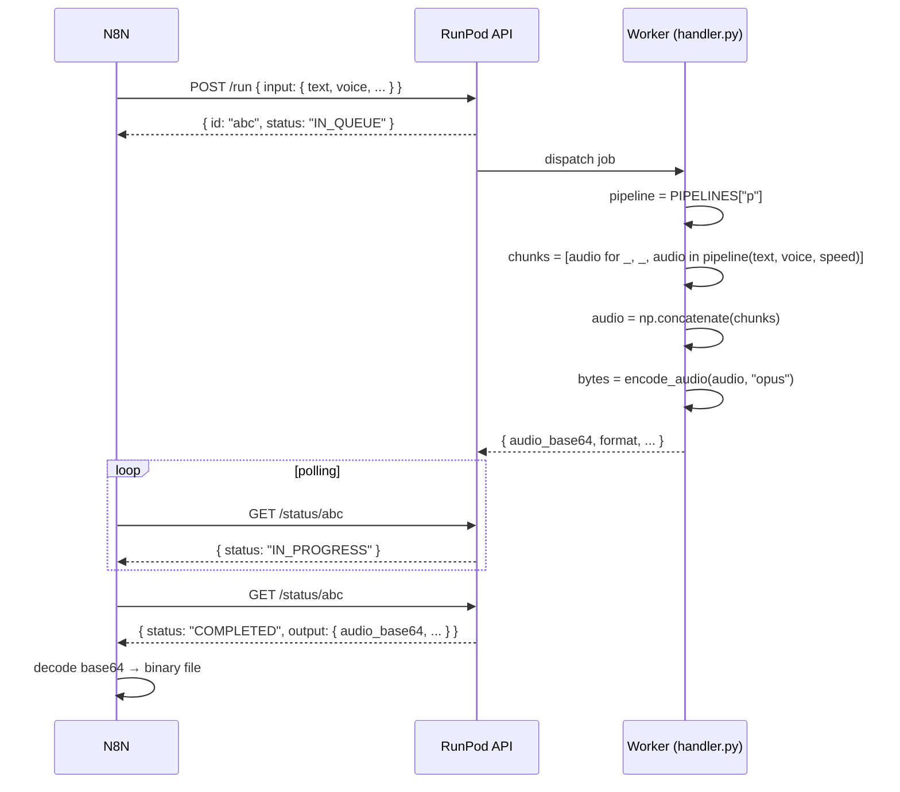

# Architecture

## Overview

## Components

- **N8N (consumer)**: an **HTTP Request** node calls `POST /v2/{endpoint}/runsync` (synchronous, up to 30s) or `POST /v2/{endpoint}/run` + polling on `/status/{id}` (asynchronous). The JSON response carries `output.audio_base64`, decoded into binary by a **Code** or **Move Binary Data** node.
- **RunPod API**: routes jobs to free workers in the configured endpoint's queue.
- **Worker** (`handler.py`): handles up to 4 concurrent jobs per worker via `concurrency_modifier`.
- **`KPipeline`** (`kokoro` lib): tokenizes the text, generates phonemes (via `misaki[pt]`), synthesizes audio chunk by chunk.
- **`soundfile`**: encodes the final numpy array into OPUS/WAV/FLAC without touching disk (`io.BytesIO`).

## Cold-start flow

1. RunPod spins up an idle container (FlashBoot skips this step when a snapshot exists).
2. The container runs `CMD ["python3.11", "-u", "handler.py"]`.
3. The `if __name__ == "__main__"` block calls `get_pipeline(DEFAULT_LANG)` → loads the PT-BR model into the GPU.
4. `runpod.serverless.start(...)` enters the queue-fetch loop.
5. The first job is processed.

**Without the pre-load (step 3)**, the first job would pay ~10s of HF download + ~5s of model loading. Because the weights are already on the filesystem (cached by the `RUN python -c ...` line in the Dockerfile), we only pay the load.

**With FlashBoot**, RunPod snapshots the container once it reaches the post-load state. Cold start drops from ~10s to 2–5s.

## Job flow

## Per-worker concurrency

Each GPU worker can process up to 4 simultaneous jobs:

- The SDK's internal loop calls `concurrency_modifier(current_count)` periodically.
- As long as the return value (`4`) is greater than `current_count`, the worker pulls another job.
- `KPipeline` is thread-safe for inference; the `PIPELINES` cache is guarded by `_PIPELINE_LOCK` only during initial creation.

## Limits and cost

| Resource             | Value                                       |
| -------------------- | ------------------------------------------- |
| VRAM per worker      | 16 GB (4× ~300 MB for Kokoro)               |
| Concurrency / worker | 4 jobs                                      |
| Estimated throughput | ~100 jobs/min per worker (depends on text length) |
| Active workers       | 5 (set in the console)                      |
| Max workers          | 30 (auto-scale)                             |
| Idle timeout         | 5s (workers shut down quickly to save cost) |
