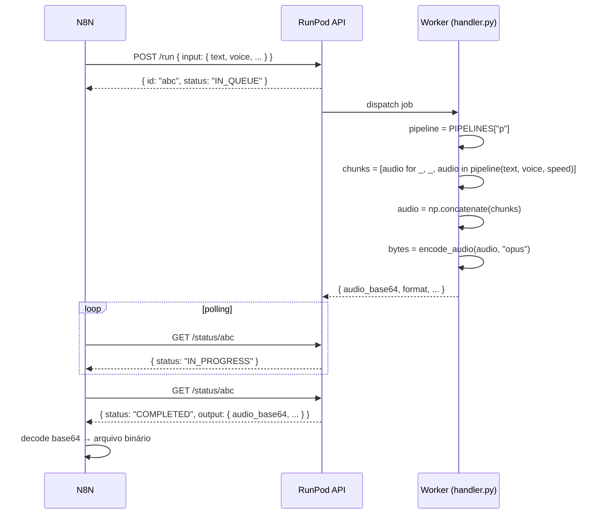

# Arquitetura

## Visão geral

```mermaid
flowchart LR
    N8N[N8N HTTP Request node]

    N8N -->|POST /runsync ou /run| RUNPOD_API[RunPod API]
    N8N -->|GET /status/&#123;id&#125; polling| RUNPOD_API
    RUNPOD_API --> QUEUE[(Job Queue)]

    subgraph RunPod_Serverless
        QUEUE --> WORKER1[Worker GPU #1]
        QUEUE --> WORKER2[Worker GPU #2]
        WORKER1 --> H1[handler.py]
        WORKER2 --> H2[handler.py]
        H1 -->|KPipeline 'p'| KOKORO1[(Kokoro 82M)]
        H2 -->|KPipeline 'p'| KOKORO2[(Kokoro 82M)]
        KOKORO1 --> AUDIO1[soundfile encode opus/wav/flac]
        KOKORO2 --> AUDIO2[soundfile encode opus/wav/flac]
    end

    AUDIO1 -->|audio_base64| RUNPOD_API
    AUDIO2 -->|audio_base64| RUNPOD_API
    RUNPOD_API -->|response JSON| N8N
```

## Componentes

- **N8N (consumidor)**: nó **HTTP Request** chama `POST /v2/{endpoint}/runsync` (síncrono, até 30s) ou `POST /v2/{endpoint}/run` + polling em `/status/{id}` (assíncrono). A resposta JSON traz `output.audio_base64`, decodificado em binário num nó **Code** ou **Move Binary Data**.
- **RunPod API**: roteia jobs para workers livres na fila do endpoint configurado.
- **Worker** (`handler.py`): processa até 4 jobs simultâneos por worker via `concurrency_modifier`.
- **`KPipeline`** (`kokoro` lib): tokeniza o texto, gera fonemas (via `misaki[pt]`), sintetiza áudio chunk a chunk.
- **`soundfile`**: codifica o numpy array final em OPUS/WAV/FLAC sem escrever em disco (`io.BytesIO`).

## Fluxo de cold start

1. RunPod sobe um container ocioso (FlashBoot pula este passo se houver snapshot).
2. Container roda `CMD ["python3.11", "-u", "handler.py"]`.
3. Bloco `if __name__ == "__main__"` chama `get_pipeline(DEFAULT_LANG)` → carrega o modelo PT-BR para a GPU.
4. `runpod.serverless.start(...)` entra no loop de fetch da fila.
5. Primeiro job é processado.

**Sem o pré-carregamento (item 3)**, o primeiro job pagaria ~10s de download HF + ~5s de load. Como os pesos já estão no filesystem (cacheados pelo `RUN python -c ...` do Dockerfile), só pagamos o load.

**Com FlashBoot**, RunPod tira um snapshot do container já no estado pós-load. Cold start cai de ~10s para 2–5s.

## Fluxo de um job

## Concorrência por worker

Cada worker GPU pode processar até 4 jobs simultâneos:

- O loop interno do SDK chama `concurrency_modifier(current_count)` periodicamente.
- Enquanto o retorno (`4`) for maior que `current_count`, o worker pega novo job.
- `KPipeline` é thread-safe pra inferência; o cache `PIPELINES` é protegido por `_PIPELINE_LOCK` apenas durante a criação inicial.

## Limites e custos

| Recurso             | Valor                                |
| ------------------- | ------------------------------------ |
| VRAM por worker     | 16 GB (4× ~300 MB para Kokoro)       |
| Concorrência/worker | 4 jobs                               |
| Throughput estimado | ~100 jobs/min por worker (depende do tamanho do texto) |
| Active workers      | 5 (configurado no console)           |
| Max workers         | 30 (auto-scale)                      |
| Idle timeout        | 5s (worker desliga rápido pra economizar) |
